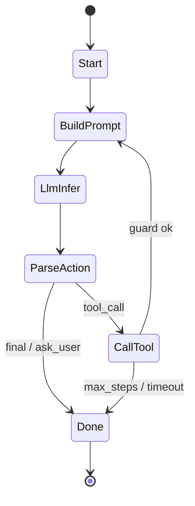

# Bob Agent Framework Design

## 1. Goal

Build a reusable Rust agent framework that:

- follows Hexagonal Architecture (ports and adapters),
- exposes a unified trait-based API ("one runtime trait"),
- uses `genai` for LLM access,
- uses official `rmcp` for MCP integration,
- uses `agent-skills` for skill loading and prompt composition,
- focuses framework-level agent abstraction and scheduling.

Project naming:

- product/framework name: `bob`.
- naming rule: keep directory and crate names concise and functional; do not prepend `bob` to directory names.

This document is implementation-ready and can be used as the baseline system design.

## 2. Design Principles

1. Domain core is dependency-free.
2. All external systems are behind ports.
3. One public runtime trait for embedding apps, with internal fine-grained ports.
4. Deterministic turn loop with explicit state transitions.
5. Capability-first security: allowlist tools, isolate skills, bound loop steps.
6. Testability by contract tests for every adapter.
7. Scheduler FSM is implemented natively in `agent-core` (`enum` + `match`), with no external FSM crate dependency.

## 3. Version and Compatibility Baseline (as of 2026-02-19)

- `genai`: pin to `0.6.0-beta.1`.
- `rmcp`: latest `0.16.0`.
- `agent-skills`: docs.rs latest `0.2.0` (repo has newer tags; validate before pinning).

Recommended initial pins for production stability:

```toml
[workspace.dependencies]
genai = "=0.6.0-beta.1"
rmcp = { version = "0.16", features = ["client", "transport-child-process", "transport-streamable-http-client"] }
agent-skills = "0.2"
async-trait = "0.1"
futures-core = "0.3"
serde = { version = "1", features = ["derive"] }
serde_json = "1"
tokio = { version = "1", features = ["rt-multi-thread", "macros", "sync", "time", "process"] }
tokio-util = "0.7"
thiserror = "2"
tracing = "0.1"
```

## 4. Workspace and Crate Layout

```text
crates/
  bob-core/                   # domain types, ports (traits), policies, scheduler state machine
  bob-runtime/                # default orchestrator implementation (depends only on bob-core)
  bob-adapters/               # all adapter implementations behind feature flags
    src/
      llm_genai.rs            # LLM adapter (genai)       — feature "llm-genai"
      mcp_rmcp.rs             # MCP adapter (rmcp)        — feature "mcp-rmcp"
      skills_agent.rs         # skills loader/composer     — feature "skills-agent"
      store_memory.rs         # in-memory store            — feature "store-memory" (default)
      observe.rs              # tracing + metrics          — feature "observe"
      lib.rs                  # re-exports enabled adapters
bin/
  cli-agent/                  # composition root: wires bob-runtime + bob-adapters
docs/
  design.md
```

### Feature flags (bob-adapters)

| Feature          | Default | Gate                          |
|------------------|---------|-------------------------------|
| `llm-genai`      | yes     | `adapter-llm-genai/` adapter  |
| `mcp-rmcp`       | yes     | `adapter-mcp-rmcp/` adapter   |
| `skills-agent`   | yes     | `adapter-skills-agent/` adapter|
| `store-memory`   | yes     | in-memory store implementation|
| `observe`        | yes     | tracing + metrics wiring      |

Hexagonal mapping:

- **Domain** (inside): `bob-core` — scheduling rules, policies, state transitions, port traits.
- **Ports** (boundary): traits defined in `bob-core`.
- **Adapters** (outside): `bob-adapters` — concrete implementations selected via feature flags.
- **Application / Composition Root**: `bob-runtime` (orchestrator) + `bin/` (wiring).

Dependency boundary rule (mandatory):

1. `bob-runtime` depends **only** on `bob-core`.
2. `bob-adapters` depends **only** on `bob-core`.
3. `bob-runtime` must **not** declare direct dependencies on `bob-adapters`.
4. `bin/` crates wire `bob-runtime` + `bob-adapters` together as composition roots.

## 5. Unified Trait Strategy

Use two layers:

1. Internal granular ports for strict hexagonal boundaries.
2. External two-phase API:
   - build/bootstrap phase (mutable registration),
   - run phase (immutable execution).

This keeps your "big unified trait" preference for runtime execution, while avoiding a "god trait" that mixes config mutation and concurrent inference.

### 5.1 External Traits: Bootstrap + Runtime

```rust
pub trait AgentBootstrap: Send {
    fn build(self) -> Result<std::sync::Arc<dyn AgentRuntime>, AgentError>
    where
        Self: Sized;
}

pub struct RuntimeBuilder { /* llm/tools/store/events/model/policy */ }

impl RuntimeBuilder {
    pub fn with_llm(self, llm: Arc<dyn LlmPort>) -> Self;
    pub fn with_tools(self, tools: Arc<dyn ToolPort>) -> Self;
    pub fn with_store(self, store: Arc<dyn SessionStore>) -> Self;
    pub fn with_events(self, events: Arc<dyn EventSink>) -> Self;
    pub fn with_default_model(self, model: impl Into<String>) -> Self;
    pub fn with_policy(self, policy: TurnPolicy) -> Self;
}

#[async_trait::async_trait]
pub trait AgentRuntime: Send + Sync {
    async fn run(&self, req: AgentRequest) -> Result<AgentRunResult, AgentError>;
    async fn run_stream(&self, req: AgentRequest) -> Result<AgentEventStream, AgentError>;
    async fn health(&self) -> RuntimeHealth;
}
```

Application dependency guidance:

- process init/startup depends on `AgentBootstrap`,
- request path depends on `AgentRuntime` only.

### 5.2 Internal Ports (Hexagonal)

```rust
#[async_trait::async_trait]
pub trait LlmPort: Send + Sync {
    async fn complete(&self, req: LlmRequest) -> Result<LlmResponse, LlmError>;
    async fn complete_stream(&self, req: LlmRequest) -> Result<LlmStream, LlmError>;
}

#[async_trait::async_trait]
pub trait ToolPort: Send + Sync {
    async fn list_tools(&self) -> Result<Vec<ToolDescriptor>, ToolError>;
    async fn call_tool(&self, call: ToolCall) -> Result<ToolResult, ToolError>;
}

#[async_trait::async_trait]
pub trait SessionStore: Send + Sync {
    async fn load(&self, id: &SessionId) -> Result<Option<SessionState>, StoreError>;
    async fn save(&self, id: &SessionId, state: &SessionState) -> Result<(), StoreError>;
}

pub trait EventSink: Send + Sync {
    fn emit(&self, event: AgentEvent);
}
```

**Deferred ports** (v1.1+): `SkillPort`, `TurnCheckpointStorePort`, `ArtifactStorePort`. See Future Work appendix.

`DefaultAgentRuntime` composes these ports via `Arc<dyn ...>` for clean plugin-like adapter boundaries.

### 5.3 Dispatch Strategy

Default composition uses trait objects (`Arc<dyn ...>`) rather than deep generic parameterization.

Reasoning:

1. cleaner API boundaries for plugin-like adapters,
2. faster compile times and simpler type signatures,
3. runtime overhead is negligible for this orchestration workload.

## 6. Domain Model

Core entities:

- `AgentRequest`: user input, session id, model hint, typed request context, and optional cancellation handle.
- `AgentResponse`: final text, tool transcript, token usage, finish reason.
- `AgentRunResult`: `Finished`.
- `SessionState`: message history, memory summary, budget counters.
- `TurnContext`: immutable runtime context with `session_id`, `trace_id`, `policy`.
- `ToolDescriptor`: tool id, schema, source (`local` or `mcp:<server>`), risk level.

Cancellation model:

- `AgentRequest` carries optional `tokio_util::sync::CancellationToken`.
- scheduler checks cancellation before and during long-running awaits via `tokio::select!`.

Action protocol (provider-neutral):

```rust
#[derive(serde::Deserialize, serde::Serialize)]
#[serde(tag = "type", rename_all = "snake_case")]
pub enum AgentAction {
    Final { content: String },
    ToolCall { name: String, arguments: serde_json::Value },
    AskUser { question: String },
}
```

This keeps scheduling stable even when provider tool-calling behavior differs.

Run result protocol:

```rust
pub enum AgentRunResult {
    Finished(AgentResponse),
}
```

Supporting protocol types:

```rust
pub type AgentEventStream =
    std::pin::Pin<Box<dyn futures_core::Stream<Item = AgentStreamEvent> + Send>>;

pub enum AgentStreamEvent {
    TextDelta { content: String },
    ToolCallStarted { name: String, call_id: String },
    ToolCallCompleted { call_id: String, result: ToolResult },
    Finished { usage: TokenUsage },
    Error { error: AgentError },
}

pub struct RuntimeHealth {
    pub status: HealthStatus,
    pub llm_ready: bool,
    pub mcp_pool_ready: bool,
}

pub enum GuardReason {
    MaxSteps,
    MaxToolCalls,
    MaxConsecutiveErrors,
    TurnTimeout,
    Cancelled,
}

pub type CancelToken = tokio_util::sync::CancellationToken;
```

> **Deferred to v1.1:** `Suspended` run result variant, `ResumeRequest`/`ResumeToken`/`SuspendReason` types, `TurnCheckpoint`, `ModelProfile`/`ModelSelector` types. See Future Work appendix.

## 7. Scheduler and Turn State Machine

The scheduler is the core framework value. It must be deterministic and bounded.

### 7.1 Turn States (v1 — 6 states)

```text
Start → BuildPrompt → LlmInfer → ParseAction → CallTool → (loop back) → Done
```

- `Start`: load session, load skills (once), initialize guard.
- `BuildPrompt`: assemble system prompt + skill block + message history + tool schemas.
- `LlmInfer`: call `LlmPort::complete` (or `complete_stream`); respect cancellation via `tokio::select!`.
- `ParseAction`: decode `AgentAction` from LLM response.
- `CallTool`: execute tool via `ToolPort::call_tool`, append result to history, check guard, loop to `BuildPrompt`.
- `Done`: persist session, emit final event, return `AgentRunResult::Finished`.

### 7.2 State Machine (Mermaid)



### 7.3 Loop Guard Defaults

- `max_steps = 12`
- `max_tool_calls = 8`
- `max_consecutive_errors = 2`
- `turn_timeout_ms = 90000`
- `tool_timeout_ms = 15000` (override per tool)
- cooperative cancellation can terminate any blocking state and return `GuardReason::Cancelled`.

### 7.4 Scheduler Pseudocode

```rust
// Start: load session + skills (once)
let session = store.load(&session_id).await?.unwrap_or_default();
let mut state = session;
let tools = tool_port.list_tools().await?;

while guard.can_continue(&state) {
    tokio::select! {
        _ = cancel_token.cancelled() => {
            store.save(&session_id, &state).await?;
            return Ok(AgentRunResult::Finished(
                finalize_with_guard_reason(GuardReason::Cancelled)
            ));
        }
        _ = async {} => {}
    }

    // BuildPrompt
    let llm_req = prompt_builder.build(&state, &tools)?;

    // LlmInfer
    let llm_resp = llm.complete(llm_req).await?;

    // ParseAction
    let action = action_codec.parse(&llm_resp)?;

    match action {
        AgentAction::Final { content } | AgentAction::AskUser { question: content } => {
            // Done
            state.append_assistant(content.clone());
            store.save(&session_id, &state).await?;
            return Ok(AgentRunResult::Finished(finalize(content)));
        }
        AgentAction::ToolCall { name, arguments } => {
            // CallTool
            policy.enforce_tool_call(&name, &arguments)?;
            let result = tool_port.call_tool(ToolCall { name, arguments }).await?;
            state.append_tool_result(result);
        }
    }
}

// Done (guard exhausted)
store.save(&session_id, &state).await?;
Ok(AgentRunResult::Finished(finalize_with_guard_reason(guard.reason())))
```

History management (v1): deterministic truncation — drop oldest non-system messages when history exceeds `max_history_messages` (configurable, default 50). No LLM-based summarization in v1.

> **Deferred to v1.1:** Full 11-state FSM with skill reselection, LLM-based history condensation, suspend/resume flow, and checkpoint-based rehydration. See Future Work appendix.

### 7.5 Streaming Semantics (`run_stream`)

`run_stream` uses the same FSM with a streaming-aware `LlmInfer` execution path.

Rules:

1. when entering `LlmInfer`, scheduler opens `LlmPort::stream`.
2. each stream chunk is forwarded as `AgentStreamEvent::TextDelta`.
3. scheduler accumulates chunks into a final assistant message buffer.
4. FSM does not transition to `ParseAction` until stream completion.
5. on stream error/timeout, scheduler emits failure event and follows guard/error policy.
6. tool execution in streaming mode emits:
   - `ToolCallStarted`,
   - `ToolCallCompleted`,
   before resuming LLM inference.

This preserves deterministic transitions while still supporting token-level UX updates.

## 8. LLM Adapter Design (`genai`)

### 8.1 Responsibilities

- Map internal `LlmRequest` to `genai` chat request.
- Normalize provider model naming and auth.
- Return unified usage and finish reason.
- Support streaming and non-streaming path.
- Expose model capability profile to scheduler.
- Provide token estimation for prompt budgeting.

### 8.2 Adapter Contract

```rust
pub struct GenAiLlmAdapter {
    client: genai::Client,
    provider_router: ProviderRouter,
}
```

Key behavior:

1. Provider resolution: from request override > runtime default > fallback chain.
2. Response normalization: extract text, usage, stop reason.
3. Retry policy: transport and 429 retry only (bounded backoff), never retry tool-caused logic errors.

### 8.3 Tool Calling Strategy with `genai`

Because provider-native function calling is not uniform across all backends, use dual mode:

- `NativeToolCallMode`: enabled only for providers with verified support.
- `JsonActionMode` (default): model must output `AgentAction` JSON envelope.

This avoids framework instability when changing model providers.

### 8.3.1 JsonActionMode Prompt Contract

When `JsonActionMode` is active, prompt builder must inject a strict output contract:

```text
You must respond with exactly one JSON object and no extra text.
Schema:
{
  "type": "final" | "tool_call" | "ask_user",
  "content": "string (required when type=final)",
  "name": "string (required when type=tool_call)",
  "arguments": "object (required when type=tool_call)",
  "question": "string (required when type=ask_user)"
}
```

Validation behavior:

1. parse as strict JSON object,
2. validate schema by `type`,
3. reject and re-prompt once on malformed output,
4. emit parser failure event if second attempt fails.

### 8.4 Capability-Aware Prompting

Scheduler must query `LlmPort::capabilities(model)` before prompt assembly.

Example capability fields:

- `supports_system_role: bool`
- `supports_native_tools: bool`
- `supports_json_schema: bool`
- `max_context_tokens: usize`

Prompt builder policy:

1. if `supports_system_role=false`, fold system instructions into user-visible preamble.
2. if `supports_native_tools=false`, force `JsonActionMode`.
3. use `estimate_tokens` to enforce hard budgets before inference.

### 8.5 models.dev Full Catalog Integration (`models-dev`)

> **[DEFERRED to v1.1]** This section is preserved for future reference. The `models-dev` crate (v0.1.1) uses `reqwest` internally which conflicts with the `hpx`-first project guideline, has only 545 downloads, and is 2021 edition. Model specification in v1 uses a simple string config (`default_model = "openai:gpt-4o-mini"`) passed directly to `genai`.

Use `models-dev` as the authoritative model catalog source for runtime routing.
Implementation target: [`verbalshadow/models.dev`](https://github.com/verbalshadow/models.dev) crate.

Catalog adapter responsibilities:

1. ingest full models.dev dataset (providers, models, context windows, capabilities, pricing, metadata),
2. normalize to internal `ModelProfile`,
3. expose deterministic selection APIs through `ModelCatalogPort`,
4. support periodic refresh and startup bootstrap.

Refresh policy:

- startup blocking refresh with cached fallback,
- background refresh interval (default 6h),
- stale cache TTL (default 24h), fail closed if cache is unavailable and remote refresh fails.

Routing policy with models.dev:

1. explicit model id wins if present,
2. else evaluate selector constraints:
   - required capabilities (`tool_use`, `vision`, `reasoning`, `json_mode`),
   - max price thresholds (`input_per_mtok`, `output_per_mtok`),
   - min context window,
3. rank candidates by policy strategy (`cost_first`, `latency_first`, `quality_first`),
4. bind final `provider:model` for `genai` request execution.

Ranking semantics:

- `cost_first`: lowest expected total token cost.
- `latency_first`: lowest configured latency class / historical percentile.
- `quality_first`: policy-defined quality tier list (configured by operator), not inferred from raw models.dev metadata.

Recommended `ModelSelector` form:

```rust
pub struct ModelSelector {
    pub explicit: Option<String>,
    pub require: Vec<ModelCapabilityFlag>,
    pub max_input_price_per_mtok: Option<f32>,
    pub max_output_price_per_mtok: Option<f32>,
    pub min_context_tokens: Option<u32>,
    pub preference: ModelPreference,
}
```

This gives complete models.dev coverage while keeping inference execution in `genai`.

### 8.6 Catalog-to-GenAI Mapping Layer

> **[DEFERRED to v1.1]** This section is preserved for future reference. See §8.5 deferral rationale.

`adapter-models-catalog` must provide an explicit mapper between models.dev identifiers and `genai` request parameters.

Mapping outcomes:

1. `Mapped`:
   - resolved to canonical `provider:model` and directly executable in `genai`.
2. `MappedWithOverrides`:
   - resolved with adapter-provided endpoint/options for providers not represented by built-in defaults.
3. `Unmapped`:
   - catalog model exists but cannot be executed by current runtime configuration.

Scheduler policy:

- if selection resolves to `Unmapped`, fail fast with actionable error and include compatible alternatives from `ModelCatalogPort::list`.
- never silently downgrade to another model unless policy explicitly enables fallback.

## 9. MCP Adapter Design (`rmcp`)

### 9.1 Responsibilities

- Connect to MCP servers (stdio, SSE, streamable-http).
- Discover tools (`tools/list`).
- Execute tools (`tools/call`) with timeout/cancellation.
- Surface MCP tools in unified `ToolPort`.

### 9.2 Components

- `McpConnectionPool`: process-wide lifecycle, reuse, reconnection, health.
- `McpToolRegistry`: tool metadata cache by server.
- `McpToolExecutor`: request/response bridge to `ToolResult`.

`McpConnectionPool` is not owned by a single agent instance. Runtime borrows logical sessions from this pool.

### 9.3 Connection Policies

- Default long-lived pool in service mode; lazy connect only on first use.
- Optional eager warmup for critical servers during process startup.
- Exponential backoff reconnect (cap 60s).
- Circuit breaker per server after repeated failures.
- Tool schema cache refresh interval (default 60s) or on-demand.
- Serverless mode: optional ephemeral pool per request with explicit cold-start warning in docs.
- Idle cleanup: reclaim inactive MCP sessions after configurable idle TTL (default 10 min).
- Process hygiene: always kill/reap child processes on pool eviction and runtime shutdown.
- Per-tenant isolation: pool keys include tenant identity and auth context; no cross-tenant session reuse.

### 9.4 Multi-Server Tool Namespace

Namespace convention:

- `local/<tool_name>`
- `mcp/<server_id>/<tool_name>`

This eliminates collisions and enables per-source policies.

### 9.5 Stdio Transport Operational Safety

For `transport = "stdio"` servers:

1. maintain process handles in pool entries.
2. on checkout failure or broken pipe, mark entry unhealthy and trigger restart policy.
3. on drop/evict, call graceful terminate then hard kill after timeout.
4. collect child exit status and emit observability events to detect zombie risk early.

### 9.6 rmcp Dyn-Compatibility Constraint

> **Important:** `rmcp` 0.16.x `ServerHandler` and `ClientHandler` traits use return-position `impl Trait` (RPITIT) and are **not dyn-compatible**. They cannot be used as `Arc<dyn ServerHandler>`.

Adapter strategy:

1. The MCP adapter uses **concrete types** internally (`rmcp::serve::RunningService<RoleClient, ...>`).
2. For managing heterogeneous MCP server connections (stdio vs HTTP), use `RunningService::into_dyn()` to erase the transport type.
3. The adapter exposes tools through `ToolPort` (which **is** dyn-compatible via `async_trait`), so the rest of the framework sees a clean `Arc<dyn ToolPort>` boundary.
4. No `dyn ServerHandler` or `dyn ClientHandler` appears in any port signature.

## 10. Skill Adapter Design (`agent-skills`)

### 10.1 Responsibilities

- Load skills from one or more directories.
- Parse frontmatter and content via `agent-skills`.
- Build runtime index for selection.
- Render selected skills into prompt blocks.

### 10.2 Skill Source Model

```rust
pub enum SkillSourceConfig {
    Directory { path: std::path::PathBuf, recursive: bool, watch: bool },
    GitMirror { local_path: std::path::PathBuf, branch: Option<String> },
}
```

Initial release should support directory sources only. Git sync can be added later.

### 10.3 Selection Algorithm (Deterministic v1)

Score each skill:

- explicit mention by name: `+1.0`
- tag overlap with request labels: `+0.4`
- keyword overlap in description/content: `+0.2`
- role/tool compatibility (from frontmatter): required filter, not bonus

Selection:

- remove disallowed skills by policy,
- sort by score then stable by name,
- choose top `k` (default `k=3`) under token budget.

### 10.4 Prompt Composition

Prompt layout:

1. System core instructions
2. Runtime policy block
3. Selected skill summary table
4. Selected skill bodies (trimmed by budget)
5. Tool contract and action JSON schema
6. Recent conversation and memory summary

Use configurable budgets:

- absolute mode: `skills_token_budget_tokens = 1800`
- relative mode (recommended): `skills_token_budget_ratio = 0.10` (10% of model context)
- overflow policy: keep metadata + truncate content by priority

### 10.5 Skills and Tool Security

- Honor `allowed_tools` if present in skill metadata.
- Effective tool set = intersection of:
  runtime policy allowlist,
  session/user allowlist,
  skill-declared allowlist.
- Never auto-run a tool solely because a skill requests it; model must still emit tool call.

### 10.6 Skill/Tool Boundary Contract

To remove ambiguity:

- Skill = prompt policy package (instructions, heuristics, optional tool constraints).
- Tool = executable capability (local function or MCP endpoint).

A skill may reference tools, but does not execute tools directly.

Prompt overflow policy for skills:

1. keep frontmatter summary and constraints intact,
2. keep procedural checklist blocks,
3. truncate examples first,
4. if still over budget, drop lowest-ranked skill (never partially keep conflicting constraints).

## 11. Sub-Agent Composition (Deferred)

Sub-agent composition via the `ToolPort` interface is planned for v1.1. Each sub-agent would appear as a tool (`agent/<id>`) backed by a child `AgentRuntime` instance with narrowed scope, depth guards, and budget slicing. See Future Work appendix for the full design.

## 12. Policy and Guardrails

Policies run before tool execution:

1. Tool allowlist/denylist by namespace.
2. Argument schema validation.
3. Max payload size.
4. Sensitive argument redaction in logs.
5. Human approval requirement for high-risk tools.

Suggested risk levels:

- `low`: read-only tools.
- `medium`: mutable local/project tools.
- `high`: network write, shell exec, secret access.

`high` requires approval token in `TurnContext`.

## 13. Persistence and Memory

Two memory lanes:

1. `SessionTranscript`: canonical short-term history (exact records).
2. `SessionSummary`: rolling summary generated periodically to control token growth.

Store interfaces:

- `SessionStore`: transcript and summary snapshots (single-process v1; optimistic concurrency deferred to v1.1).
- `TurnCheckpointStorePort` (deferred to v1.1): suspend/resume checkpoints keyed by `resume_token`.
- `ArtifactStorePort` (deferred to v1.1): large tool outputs by reference id.

Default implementation path:

- v1: `InMemory` and `FileJson` stores (fast adoption, easy debugging).
- v1.1: optional SQLite adapter behind feature flag.
- v2: SQLite promoted to default only after migration tooling is stable.

History condensation policy (required):

1. trigger when projected prompt tokens exceed `history_condense_trigger_ratio` (default `0.75`) of model context.
2. condense target keeps history under `history_condense_target_ratio` (default `0.40`).
3. condensation executor is scheduler-owned and uses `LlmPort` with a configured summarization model.
4. on condensation failure:
   - first retry once with tighter prompt,
   - if still failing, fall back to deterministic truncation and emit warning event.

## 14. Observability

Emit structured events for every state transition:

- `turn.started`
- `skills.selected`
- `llm.requested`
- `llm.stream.chunk` (streaming mode)
- `llm.completed`
- `tool.called`
- `tool.completed`
- `mcp.process.started`
- `mcp.process.stopped`
- `turn.finished`

Attach fields:

- `trace_id`, `session_id`, `turn_id`
- `model`, `provider`, latency
- token usage
- selected skill ids
- tool name and status

Use `tracing` spans for nested timing and optional OpenTelemetry exporter.

## 15. Configuration Model

Example `agent.toml` (v1 minimal surface):

```toml
[runtime]
default_model = "openai:gpt-4o-mini"
max_steps = 12
turn_timeout_ms = 90000

[llm]
retry_max = 2
stream_default = false

[policy]
require_high_risk_approval = true
deny_tools = ["local/shell_exec"]

[[mcp.servers]]
id = "filesystem"
transport = "stdio"
command = "npx"
args = ["-y", "@modelcontextprotocol/server-filesystem", "."]
tool_timeout_ms = 15000
env = { OPENAI_API_KEY = "${OPENAI_API_KEY}" }

[[skills.sources]]
type = "directory"
path = "./skills"
```

> **Deferred to v1.1:** `[runtime.resume]`, `[mcp.pool]` (tenant-scoped pooling), `[prompt]` ratio configs, `[models_catalog]`, `[[subagents]]`. These will be added as the features they support stabilize.

Config loading order:

1. default values,
2. file,
3. environment variables,
4. runtime overrides.

Environment interpolation rule:

- values in `${VAR_NAME}` form are resolved from process environment at startup.

## 16. Error Taxonomy

```rust
#[derive(thiserror::Error, Debug)]
pub enum AgentError {
    #[error("LLM provider error: {0}")]
    Llm(#[from] LlmError),
    #[error("Tool execution error: {0}")]
    Tool(#[from] ToolError),
    #[error("Skill error: {0}")]
    Skill(#[from] SkillError),
    #[error("Policy violation: {0}")]
    Policy(#[from] PolicyError),
    #[error("Store error: {0}")]
    Store(#[from] StoreError),
    #[error("timeout")]
    Timeout,
    #[error("guard exceeded: {0:?}")]
    GuardExceeded(GuardReason),
    #[error(transparent)]
    Internal(#[from] Box<dyn std::error::Error + Send + Sync>),
}
```

Rules:

- do not leak provider raw errors directly to users,
- persist internal details in telemetry,
- map user-facing errors to concise actionable messages.

## 17. Testing Strategy

### 17.1 Unit Tests

- action parsing (`JsonActionMode`),
- skill scoring and selection determinism,
- guard transitions and timeout behavior,
- policy enforcement logic.
- scheduler tests with `MockLlmPort`, `MockToolPort`, `MockEventSink`.

### 17.2 Adapter Contract Tests

- `genai` adapter: request mapping and normalized responses.
- `rmcp` adapter: tool listing and calling against a local fake MCP server.
- `agent-skills` adapter: directory loading and prompt rendering.

### 17.3 Integration Tests

- full turn with local tool only,
- full turn with MCP tool,
- full turn with skills enabled and budget truncation,
- failure scenarios (MCP down, tool timeout, malformed model action).

### 17.4 Reliability Tests

- replay test corpus for deterministic outcomes,
- soak test with concurrent sessions (`N=100+`),
- latency and token budget regression checks in CI.

### 17.5 Replay/Tape Mode

Provide a `TapeLlmAdapter`:

1. record mode: capture real LLM request/response pairs into JSON fixtures.
2. replay mode: serve fixture responses offline in CI.

This keeps deterministic regression tests while avoiding live provider variance and API costs.

## 18. Implementation Plan (v1 — Phased)

### Phase 1: Foundation (bob-core + bob-runtime)

- Define domain types, error types, 4 port traits in `bob-core`.
- Define `AgentBootstrap` + `AgentRuntime` traits in `bob-runtime`.
- Implement `DefaultAgentRuntime` with stub scheduler.
- Verify all traits compile with mock implementations and tests.

### Phase 2: Scheduler

- Implement the 6-state turn loop in `DefaultAgentRuntime`.
- Wire loop guard, cancellation, and deterministic history truncation.
- Test with mock `LlmPort` and `ToolPort` (no real adapters yet).

### Phase 3: Adapters (bob-adapters)

- Implement `GenAiLlmAdapter` (`LlmPort` via `genai`): non-streaming + streaming.
- Implement `McpToolAdapter` (`ToolPort` via `rmcp`): stdio + streamable-http transports.
- Implement in-memory `SessionStore` and `tracing`-based `EventSink`.
- Contract tests for each adapter.

### Phase 4: CLI Integration (bin/cli-agent)

- Wire adapters → runtime → CLI with TOML config loading.
- End-to-end turn loop: user input → LLM → tool calls → final response.
- Add `agent-skills` loading for system prompt enrichment.

### Phase 5: Hardening

- Replay/tape mode for deterministic test corpus.
- Soak tests with concurrent sessions.
- API freeze for `AgentBootstrap` + `AgentRuntime`.

> **Deferred phases:** model catalog, sub-agents, SQLite store, observability dashboards. See Appendix A.

## 19. API Freeze Criteria (for v1.0)

All must be true:

1. `AgentBootstrap` and `AgentRuntime` traits unchanged for two minor releases.
2. All 4 adapter implementations pass contract tests.
3. Tool namespace and risk policy stable.
4. P95 turn latency within target under defined load profile.
5. Stream event protocol stable and consumed by CLI client.
6. Loop guard deterministic under mock replay with pass rate >= 99.9%.

## 20. Risks and Mitigations

1. Provider behavior drift in tool-calling.
   - Mitigation: default to `JsonActionMode`, enable native mode per provider capability flag.
2. MCP server instability.
   - Mitigation: circuit breaker + fallback + per-server health.
3. Skill prompt bloat.
   - Mitigation: strict token budget + summary-first rendering.
4. Cross-adapter error complexity.
   - Mitigation: strict `AgentError` taxonomy and event-level diagnostics.
5. MCP stdio orphan/zombie process risk.
   - Mitigation: pool-managed child lifecycle, idle eviction, and terminate-then-kill shutdown policy.
6. Multi-replica session write races.
   - Mitigation: v1 single-process; `SessionStore` CAS writes deferred to v1.1 multi-replica support.
7. Long-running turn cancellation not honored.
   - Mitigation: cooperative cancellation checks via token + `tokio::select!` around blocking awaits.

## 21. Immediate Next Steps

1. ~~Scaffold crates and compile empty trait contracts.~~ ✅ Done (bob-core, bob-runtime, bob-adapters, bin/cli-agent).
2. ~~Implement scheduler turn loop with mock ports and deterministic transition tests.~~ ✅ Done (LoopGuard, action parser, prompt builder, 6-state FSM).
3. ~~Add `genai` adapter and run end-to-end local CLI demo.~~ ✅ Done (GenAiLlmAdapter, CLI REPL with config loading).
4. ~~Add `rmcp` adapter with contract tests.~~ ✅ Done (McpToolAdapter with stdio transport, CompositeToolPort for multi-server).
5. Add `agent-skills` loading for system prompt enrichment. (Deferred — no `agent-skills` code in v1.)

## 22. Reviewer Feedback Disposition

Reviewer item disposition:

1. `AskUser` suspension/resume gap.
   - Verdict: Correct.
   - Action: Added `AgentRunResult::Suspended`, `ResumeRequest`, `TurnCheckpoint`, and `resume()` flow.
2. God-trait risk on `AgentRuntime`.
   - Verdict: Correct.
   - Action: Split external API into `AgentBootstrap` (write/config phase) and `AgentRuntime` (read/execute phase).
3. MCP connection lifecycle complexity.
   - Verdict: Correct.
   - Action: Introduced process-wide `McpConnectionPool` and serverless fallback mode.
4. Token budget estimation location.
   - Verdict: Correct with refinement.
   - Action: Added `LlmPort::estimate_tokens` and capability-aware prompt assembly.
5. Skill vs tool boundary ambiguity.
   - Verdict: Partially correct.
   - Action: Clarified contract: skill is prompt policy package; tool is executable capability.
6. SQLite may be early for v1.
   - Verdict: Reasonable.
   - Action: v1 now targets in-memory + file-json; SQLite moved to optional feature stage.

Additional reviewer-driven enhancement:

- Added explicit "Agent as a Tool" architecture for multi-agent/sub-agent systems with depth, cycle, timeout, and budget controls.

## 23. Directive Update Log (2026-02-19)

Applied user directives for this revision:

1. Remove `tokio-fsm` and do not plan future introduction.
   - Applied: yes. All `tokio-fsm` references removed; core FSM policy is native `enum` + `match`.
2. Rename `adapter-observe-tracing` to `adapter-observe`.
   - Applied: yes. Workspace layout updated.
3. Move examples out of `crates/examples` and use `bin/`.
   - Applied: yes. `bin/cli-agent` and `bin/service-agent` layout defined.
4. Project name is `bob`, but keep concise directory names without `bob` prefix.
   - Applied: yes. Title and naming policy updated.
5. Pin `genai` to `0.6.0-beta.1`.
   - Applied: yes. Dependency pin updated.
6. Add complete `models.dev` model support.
   - Applied: yes, then **deferred to v1.1** (Task 1.2). `models-dev` removed from v1 deps; `ModelCatalogPort` removed from v1 ports; §8.5/8.6 marked deferred; v1 uses simple `default_model` string config.

## 24. Second Reviewer Disposition (2026-02-19)

Assessment of latest reviewer feedback:

1. Resume rehydration complexity.
   - Verdict: Correct.
   - Action: clarified pure-data checkpoint rule and mandatory dependency re-initialization during `resume`.
2. `models.dev` and `genai` impedance mismatch. **(DEFERRED to v1.1)**
   - Verdict: Correct, but deferred. v1 uses simple string model config.
   - Action: §8.6 mapper layer preserved for future reference; not implemented in v1.
3. Streaming vs FSM transition conflict.
   - Verdict: Correct.
   - Action: added streaming FSM semantics (`run_stream` chunk-forward + buffered finalize + parse-after-complete).
4. MCP pool lifecycle and zombie risk.
   - Verdict: Correct.
   - Action: added idle TTL cleanup, child-process hygiene, and tenant/auth isolation rules.
5. Error conversion ergonomics (`thiserror`).
   - Verdict: Correct.
   - Action: updated `AgentError` sample with `#[from]` conversions.
6. Dynamic dispatch recommendation.
   - Verdict: Correct and already aligned.
   - Action: added explicit dispatch strategy note favoring trait objects.
7. Testing additions (mock ports + tape replay).
   - Verdict: Correct.
   - Action: expanded testing strategy with `Mock*Port` and `TapeLlmAdapter` mode.
8. MCP config env injection.
   - Verdict: Correct.
   - Action: added `env` map and interpolation rule in configuration model.

## 25. Third Reviewer Disposition (2026-02-19)

Assessment of latest reviewer feedback:

1. Hexagonal boundary leak risk in `agent-runtime`.
   - Verdict: Correct.
   - Action: added mandatory dependency boundary rule (`agent-runtime` must not depend on any `adapter-*` crate).
2. `AgentBootstrap::build` signature ergonomics.
   - Verdict: Correct.
   - Action: changed to consuming `self` with `Self: Sized` rather than `self: Box<Self>`.
3. `run_stream` event protocol undefined.
   - Verdict: Correct.
   - Action: added `AgentStreamEvent` protocol and `AgentEventStream` type definition.
4. Skill reselection frequency ambiguity.
   - Verdict: Correct.
   - Action: set v1 default to select once per turn with optional reselection policy.
5. Summary trigger policy missing.
   - Verdict: Correct.
   - Action: added explicit condensation trigger/target ratios and failure fallback behavior.
6. Cancellation mechanism missing.
   - Verdict: Correct.
   - Action: added cancellation model, guard semantics, and scheduler cancellation checks.
7. `TurnCheckpointStorePort` missing.
   - Verdict: Not correct for current document state.
   - Action: no new change required; trait already existed and remains in ports section.
8. Session write race concerns.
   - Verdict: Correct.
   - Action: upgraded `SessionStorePort` to optimistic concurrency with `expected_version`.
9. `AgentError::ModelCatalog` missing.
   - Verdict: Not correct for current document state.
   - Action: no new change required; variant already present.
10. `Internal(String)` loses error chain.
    - Verdict: Correct.
    - Action: replaced with transparent boxed source error variant.
11. Sub-agent suspend propagation ambiguity.
    - Verdict: Correct.
    - Action: v1 inline mode now forbids child `AskUser`; adapter converts to tool error.
12. `JsonActionMode` schema contract missing.
    - Verdict: Correct.
    - Action: added strict prompt contract and validation behavior.
13. `quality_first` semantics unclear.
    - Verdict: Correct.
    - Action: defined quality strategy as operator-configured tier list.
14. Example model id and skill budget expression concerns.
    - Verdict: Correct.
    - Action: changed sample model to `openai:gpt-4o-mini` and added ratio-based skill budget config.
15. Missing supporting type definitions (`RuntimeHealth`, `ArtifactStorePort`, `GuardReason`, stream event types).
    - Verdict: Correct.
    - Action: added explicit supporting protocol/type definitions and artifact port.

---

## Appendix A: Future Work (Deferred from v1)

This appendix collects features, types, and subsystems that were part of the north-star design but are deferred beyond v1 to reduce scope and implementation risk.

### A.1 Suspend / Resume

- `AgentRunResult::Suspended { reason, resume_token, question }` variant
- `SuspendReason` enum: `AskUser`, `ApprovalRequired`, `ExternalWait`
- `ResumeRequest`: `resume_token` + user reply payload
- `ResumeToken`: opaque, signed, with server-side checkpoint lookup
- `TurnCheckpoint` / `TurnCheckpointStorePort`: serializable scheduler state for rehydration
- `AgentRuntime::resume()` method
- Resume flow: load checkpoint → re-acquire deps → append user payload → re-enter scheduler

### A.2 Model Catalog (`models-dev`)

- `ModelCatalogPort` trait with `list()`, `resolve()`, `select()` methods
- `ModelProfile`, `ModelSelector`, `ModelPreference` types
- `models-dev` crate integration for runtime model routing
- Catalog-to-GenAI mapping layer (`Mapped`/`MappedWithOverrides`/`Unmapped`)
- Routing policies: `cost_first`, `latency_first`, `quality_first`
- Periodic refresh and cached fallback
- Requires resolution of `reqwest` vs `hpx` dependency conflict in `models-dev`

### A.3 Sub-Agent System

- "Agent as a Tool" pattern: parent sees sub-agents as `agent/<id>` tools
- `SubAgentToolAdapter` struct wrapping a child `AgentRuntime`
- `SubAgentProfile`: model, allowed tools, skill sources, max steps, max depth, timeout
- Safety: `max_depth` guard, cycle detection, budget slicing, permission narrowing, failure isolation
- Scheduling modes: inline (child completes within parent turn) and async delegation
- Configuration via `[[subagents]]` TOML blocks

### A.4 Advanced Scheduler Features

- Full 11-state FSM with `MaybeCondenseHistory`, `MaybeReselectSkills` states
- LLM-based history condensation (summarize old messages to free context budget)
- Dynamic skill reselection on major state changes
- Suspend state in the scheduler FSM

### A.5 Additional Port Traits

- `SkillPort`: runtime skill selection, scoring, prompt rendering
- `ArtifactStorePort`: binary/structured artifact persistence
- `TurnCheckpointStorePort`: scheduler checkpoint persistence for resume

### A.6 SQLite Session Store

- `adapter-store-sqlite` crate with `sqlx`-backed `SessionStore` implementation
- Optimistic concurrency via `expected_version` CAS on save

### A.7 Configuration Extensions

- `[runtime.resume]`: checkpoint TTL, HMAC signing key
- `[mcp.pool]`: tenant-scoped pooling, idle TTL, shutdown grace
- `[prompt]`: skills token budget ratio, history condense trigger/target ratios
- `[[subagents]]`: sub-agent profiles
- `[runtime.cancellation]`: cooperative cancellation mode config
